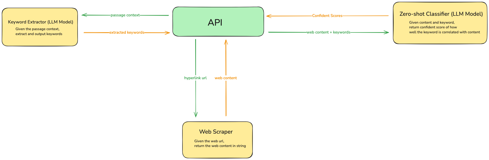

# HyperlinkCheck

## About the project

***HyperlinkCheck*** is an API service to verify if hyperlinks fit in current passage context. The usecase is best demonstrated with the below example.
> Assuming below two hyperlinks contains the same url: https://en.wikipedia.org/wiki/Artificial_intelligence
> 
> (correct link) It is a [link](https://en.wikipedia.org/wiki/Artificial_intelligence) that talks about AI --- pass ***HyperlinkCheck***
> 
> (incorrect link) It is a [link](https://en.wikipedia.org/wiki/Artificial_intelligence) that talks about Elon Musk --- fail ***HyperlinkCheck***


## How to set up and run the API

### Set up LLM models
This API contains three NLP/LLM models. To run API locally, please note below links to download these models and put them under `/models`

1. [bart-large-mnli](https://huggingface.co/facebook/bart-large-mnli)
2. [keyphrase-extraction-kbir-inspec](https://huggingface.co/ml6team/keyphrase-extraction-kbir-inspec)
3. [taggers and tokenizers in nltk_data](https://www.nltk.org/data.html)

**Note**: For production performance, the first two LLM models should be deloyed with dedicated computing resource

### Install Dependency and Run API
```shell
pip install -r requirements.txt # install dependency

fastapi dev main.py # run HyperlinkCheck API
```
## API Usage

**POST** `/verify`

Body (Array of below JSON)
```json
{ "hyperlink": "https://en.wikipedia.org/wiki/Artificial_intelligence", // link url
  "passage_context":
  {
      "linked_str": "link", // the word with the link
      "sentence": "It is a link that talks about AI" // the sentence contains the link
  }
}

```
**Note**: The body is essientially a JSON translated format of a hyperlink. The above sample body is based on the demonstrated example from the beginning.
 * For `passage_context`, you could add more context by additional key & value pair but every `passage_context` should contain at least `linked_str` and `sentence`

Repsonse (Array of below JSON)
```json
{
      "validation_code": 0, // validation code
      "keywords": ["AI"], // keywords extracted based on passage_context
      "scores": [0.99858654] // confidence level for how well each keyword fit in the link url's web content
}
```
**Note**: `scores` can be used to determine how well the hyperlink fit the current context
## Architecture Overview
The API Service contains below three major components
1. **Keyword Extractor**: It is a LLM model to extract keywords given `passage_context`
2. **Web Scraper**: It is an virtual bot to scrape the web content based on `hyperlink` url
3. **Zero-shot Classifier**: It is an LLM model to calculate confident scores for every keyword given `passage_context`

### API Process Flow
1. Call **Keyword Extractor** to extract keywords
2. Call **Web Scrpaer** for website content
3. Call **Zero-shot Classifier** to calculate confident scores for every keyword based on website content
4. Return reponse to client



## Contact

Gaoyuan Zhang
* [![github]](https://github.com/gocodezhang)
* [![gmail]](mailto:zgy25483387@gmail.com)


[github]: https://img.shields.io/badge/GitHub-181717.svg?style=for-the-badge&logo=GitHub&logoColor=white
[gmail]: https://img.shields.io/badge/Gmail-D14836?style=for-the-badge&logo=gmail&logoColor=white